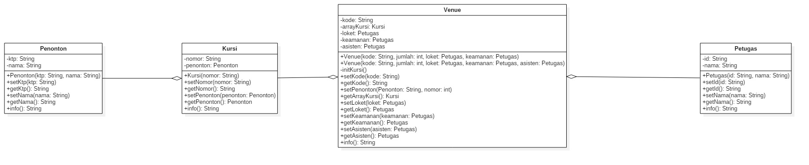

# Tugas Jobsheet 4

merancang sebuah program sebuah konser musik yang melibatkan 4 class diantaranya adalah Penonton, Kursi, Venue, dan Petugas seperti di bawah ini.

## Class Diagram

## Source Code
-- Class Penonton

public class Penonton {

    private String ktp;
    private String nama;

    public Penonton(String k, String n) {
        ktp = k;
        nama = n;
    }

    public void setKtp(String ktp) {
        this.ktp = ktp;
    }

    public String getKtp() {
        return ktp;
    }

    public void setNama(String nama) {
        this.nama = nama;
    }

    public String getNama() {
        return nama;
    }

    public String info() {
        String info = "";
        info += "Ktp : " + ktp + "\n";
        info += "Nama : " + nama + "\n";
        return info;
    }
}

-- Class kursi

public class Kursi {

    private String nomor;
    private Penonton penonton;

    public Kursi(String n) {
        nomor = n;
    }

    public void setNomor(String nomor) {
        this.nomor = nomor;
    }

    public String getNomor() {
        return nomor;
    }

    public void setPenonton(Penonton penonton) {
        this.penonton = penonton;
    }

    public Penonton getPenonton() {
        return penonton;
    }

    public String info() {
        String info = "";
        info += "Nomor: " + nomor + "\n";
        if (this.penonton != null) {
            info += "Penumpang: " + penonton.info() + "\n";
        }

        return info;
    }
}

-- Class Venue

public class Venue {

    private String kode;

    private Kursi[] arrayKursi;
    private Petugas loket;
    private Petugas keamanan;
    private Petugas asisten;

    public Venue(String kode, Petugas loket, Petugas keamanan, int jumlah) {
        this.kode = kode;
        this.arrayKursi = new Kursi[jumlah];
        this.initKursi();
        this.keamanan = keamanan;
        this.loket = loket;
    }

    public Venue(String kode, Petugas loket, Petugas keamanan, Petugas asisten, int jumlah) {
        this.kode = kode;
        this.arrayKursi = new Kursi[jumlah];
        this.initKursi();
        this.keamanan = keamanan;
        this.loket = loket;
        this.asisten = asisten;
    }

    private void initKursi() {
        for (int i = 0; i < arrayKursi.length; i++) {
            this.arrayKursi[i] = new Kursi(String.valueOf(i + 1));
        }
    }

    public void setkode(String kode) {
        this.kode = kode;
    }

    public String getKode() {
        return kode;
    }

    public void setPenonton(Penonton penonton, int nomor) {
        int index = nomor - 1;
        if (arrayKursi[index].getPenonton() != null) {
            System.out.println("Kursi telah terisi silahkan pilih kursi yang lain");
        } else {
            this.arrayKursi[nomor - 1].setPenonton(penonton);
        }

    }

    public void setLoket(Petugas loket) {
        this.loket = loket;
    }

    public Petugas getLoket() {
        return loket;
    }

    public void setKeamanan(Petugas keamanan) {
        this.keamanan = keamanan;
    }

    public Petugas getKeamanan() {
        return keamanan;
    }

    public void setAsisten(Petugas asisten) {
        this.asisten = asisten;
    }

    public Petugas getAsisten() {
        return asisten;
    }

    public Kursi[] getArrayKursi() {
        return arrayKursi;
    }

    public String info() {
        String info = "";
        info += "Kode: " + kode + "\n";
        if (this.asisten != null) {
            info += "Asisten : " + this.asisten.info() + "\n";
        }
        for (Kursi kursi : arrayKursi) {
            info += kursi.info();
        }
        return info;
    }
}

-- Class Petugas

public class Petugas {

    private String id;
    private String nama;

    public Petugas(String i, String nm) {
        id = i;
        nama = nm;
    }

    public void setId(String id) {
        this.id = id;
    }

    public String getId() {
        return id;
    }

    public void setNama(String nama) {
        this.nama = nama;
    }

    public String getNama() {
        return nama;
    }

    public String info() {
        String info = "";
        info += "id: " + this.id + "\n";
        info += "Nama: " + this.nama + "\n";
        return info;
    }
}

-- Class Main

public class MainTugas {

    public static void main(String[] args) {
        Penonton p = new Penonton("194184", "Diva Ardhia");
        Petugas loket = new Petugas("010", "Misamo");
        Petugas keamanan = new Petugas("005", "Jamal");
        Petugas asisten = new Petugas("001", "Arin");

        Venue v = new Venue("A", loket, keamanan, 20);
        v.setPenonton(p, 1);
        Penonton f = new Penonton("194199", "Fadhila Khoirun");
        v.setPenonton(f, 7);
        Penonton d = new Penonton("194168", "dannie salsabila");
        v.setPenonton(d, 7);
        System.out.println(v.info());

        Venue ve = new Venue("A", loket, keamanan, asisten, 10);
        System.out.println(ve.info());
    }
}

## Output

## Penjelasan 
Data diatas terdapat 3 petugas didalam venue yaitu petugas loket, keamanan, dan asisten. jika tidak ada asistenpun tidak masalah. 
seorang penonton bernama diva memilih kursi nomer 1 sehingga datanya masuk ke kursi 1, penonton bernama fadhila dan dan dannie memilih kursi yang sama yaitu nomer 7 karena lebih cepat fadhila maka dannie harus memilih kursi lain.