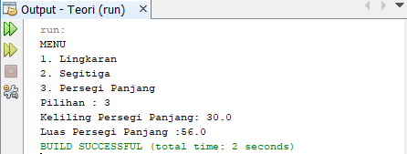
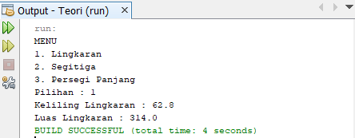

# Teori PBO Inheritance

## Class BangunDatar

public class BangunDatar {

    public float luas() {
        return 0;
    }

    public float keliling() {
        return 0;
    }
}

## Class PersegiPanjang

public class PersegiPanjang extends BangunDatar {

    public float panjang;
    public float lebar;

    public float luas() {
        float luas = panjang * lebar;
        System.out.println("Luas Persegi Panjang :" + luas);
        return luas;
    }

    @Override
    public float keliling() {
        float keliling = 2 * panjang + 2 * lebar;
        System.out.println("Keliling Persegi Panjang: " + keliling);
        return keliling;
    }
}

## output persegi panjang

## Class Lingkaran 

public class Lingkaran extends BangunDatar {

    public float r;

    public float luas() {
        float luas = (float) (3.14 * r * r);
        System.out.println("Luas Lingkaran : " + luas);
        return luas;
    }

    public float keliling() {
        float keliling = (float) (2 * 3.14 * r);
        System.out.println("Keliling Lingkaran : " + keliling);
        return keliling;
    }
}

## output lingkaran

## Class Segitiga

public class Segitiga extends BangunDatar {

    public float alas;
    public float tinggi;

    public float luas() {
        float luas = (alas * tinggi)/2;
        System.out.println("Luas Segitiga: " + luas);
        return luas;
    }

    public float keliling() {
        float keliling = (alas * 3);
        System.out.println("Keliling Segitiga: " + keliling);
        return keliling;
    }
}

## output segitiga

## Class Main

public class Main {
    
    public static void main(String[] args) {
        int pil;
        Lingkaran L = new Lingkaran();
        Segitiga S = new Segitiga();
        PersegiPanjang P = new PersegiPanjang();
        Scanner inp = new Scanner(System.in);
        System.out.println("MENU");
        System.out.println("1. Lingkaran");
        System.out.println("2. Segitiga");
        System.out.println("3. Persegi Panjang");
        System.out.print("Pilihan : ");
        pil = inp.nextInt();
        switch (pil) {
            case 1:
                L.r = 10;
                L.keliling();
                L.luas();
                break;
            case 2:
                S.alas = 10;
                S.tinggi = 7;
                S.luas();
                S.keliling();
                break;
            case 3:
                P.panjang = 8;
                P.lebar = 7;
                P.keliling();
                P.luas();
                break;

        }
    }
}

## Penjelasan

saya membuat output dimana ada menu yang terdiri dari 3 bangun datra yaitu Lingkaran, Segitiga, dan Persegi Panjang sehingga user dapat memilih menampilkan data luas dan keliling satu bangun diantara ketiga bangun yang terdapat dalam menu tersebut.