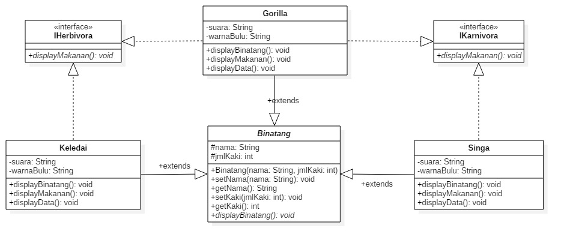

# Laporan Tugas Jobsheet 11

## Source Code Binatang

public abstract class Binatang {

    protected String nama;
    protected int jmlKaki;

    public Binatang(String nama, int jmlKaki) {
        this.nama = nama;
        this.jmlKaki = jmlKaki;
    }

    public void setNama(String nama) {
        this.nama = nama;
    }

    public String getNama() {
        return nama;
    }

    public void setJmlKaki(int jmlKaki) {
        this.jmlKaki = jmlKaki;
    }

    public int getJmlKaki() {
        return jmlKaki;
    }

    public abstract void displayBinatang();
}

## Source Code IKarnivora

public interface IKarnivora {

    void displayMakanan();
}

## Source Code IHerbivora

public interface IHerbivora {

    void displayMakanan();
}

## Source Code Singa

public class Singa extends Binatang implements IKarnivora {

    private String suara;
    private String warnaBulu;

    public Singa(String suara, String warnaBulu, String nama, int jmlKaki) {
        super(nama, jmlKaki);
        this.suara = suara;
        this.warnaBulu = warnaBulu;
    }

    public void displayMakanan() {
        System.out.println("makanan : " + " Daging");
    }

    @Override
    public void displayBinatang() {
        System.out.println("Jenis : " + "Karnivora"); //To change body of generated methods, choose Tools | Templates.
    }

    public void displayData() {
        System.out.println("Nama : " + this.nama);
        System.out.println("Jumlah Kaki : " + this.jmlKaki);
        System.out.println("Suara : " + this.suara);
        System.out.println("Warna Bulu : " + this.warnaBulu);
    }
}

## Source Code Keledai

public class Keledai extends Binatang implements IHerbivora {

    private String suara;
    private String warnaBulu;

    public Keledai(String suara, String warnaBulu, String nama, int jmlKaki) {
        super(nama, jmlKaki);
        this.suara = suara;
        this.warnaBulu = warnaBulu;
    }

    public void displayMakanan() {
        System.out.println("makanan : Tumbuhan");
    }

    @Override
    public void displayBinatang() {
        System.out.println("Jenis : Herbivora"); //To change body of generated methods, choose Tools | Templates.
    }

    public void displayData() {
        System.out.println("Nama : " + this.nama);
        System.out.println("Jumlah Kaki : " + this.jmlKaki);
        System.out.println("Suara : " + this.suara);
        System.out.println("Warna Bulu : " + this.warnaBulu);
    }
}

## Source Code Gorilla

public class Gorilla extends Binatang implements IHerbivora, IKarnivora {

    private String suara;
    private String warnaBulu;

    public Gorilla(String suara, String warnaBulu, String nama, int jmlKaki) {
        super(nama, jmlKaki);
        this.suara = suara;
        this.warnaBulu = warnaBulu;
    }

    @Override
    public void displayBinatang() {
        System.out.println("Makanan : " + "Daging + Tumbuhan"); //To change body of generated methods, choose Tools | Templates.
    }

    @Override
    public void displayMakanan() {
        System.out.println("Jenis : " + "Karnivora + Herbivora"); //To change body of generated methods, choose Tools | Templates.
    }

    public void displayData() {
        System.out.println("Nama : " + this.nama);
        System.out.println("Jumlah Kaki : " + this.jmlKaki);
        System.out.println("Suara : " + this.suara);
        System.out.println("Warna Bulu : " + this.warnaBulu);
    }
}

## Source Code Program/Main

public class Program {

    public static void main(String[] args) {
        Keledai k = new Keledai("Hehehehe", "Abu-abu", "Kedelai", 4);
        Gorilla g = new Gorilla("Haaum Haaum", "Hitam Manis", "Gulali", 4);
        Singa s = new Singa("Roaar Roaaar", "Coklat", "CingaCing", 4);

        k.displayBinatang();
        k.displayMakanan();
        k.displayData();
        System.out.println();

        g.displayBinatang();
        g.displayMakanan();
        g.displayData();
        System.out.println();

        s.displayBinatang();
        s.displayMakanan();
        s.displayData();
        System.out.println();
    }
}

## output

## Penjelasan

terdapat 3 class yaitu Singa, Keledai, dan Gorilla yang mengextends abstrak class Binatang yang beratribut nama dan jumlah kaki, kemudian memiliki konstruktor berparameter, juga memiliki method setter, getter atribut dan method abstrak displayBinatang(). 

terdapat class interface IKarnivora yang bermethod (abstrak) displayMakanan() diimplementasikan class Singa dan Gorilla.

terdapat class interface IKHerbivora yang bermethod (abstrak) displayMakanan() diimplementasikan class Keledai dan Gorilla.

jadi Gorilla mengimplementasi 2 class interface yaitu, IKarnivora dan Iherbivora. 

## Class Diagram UML

